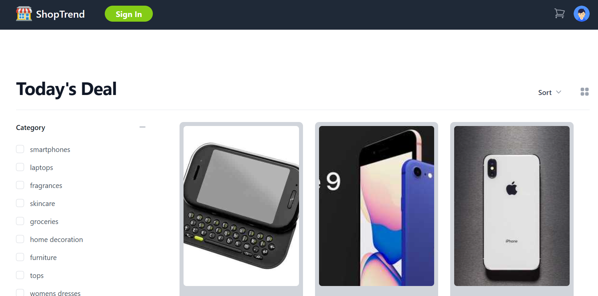
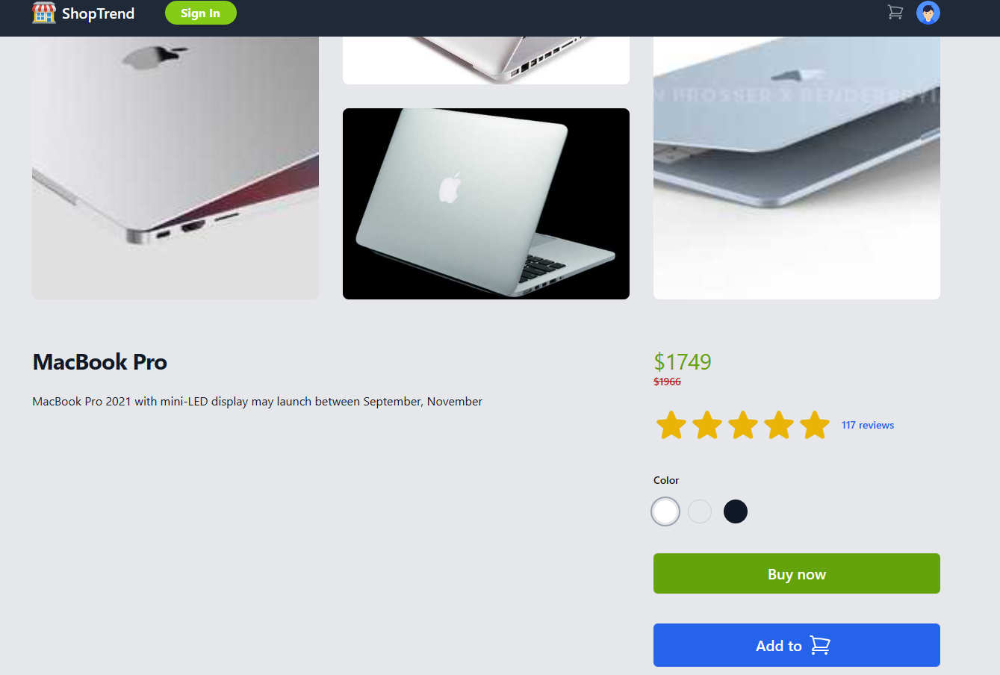
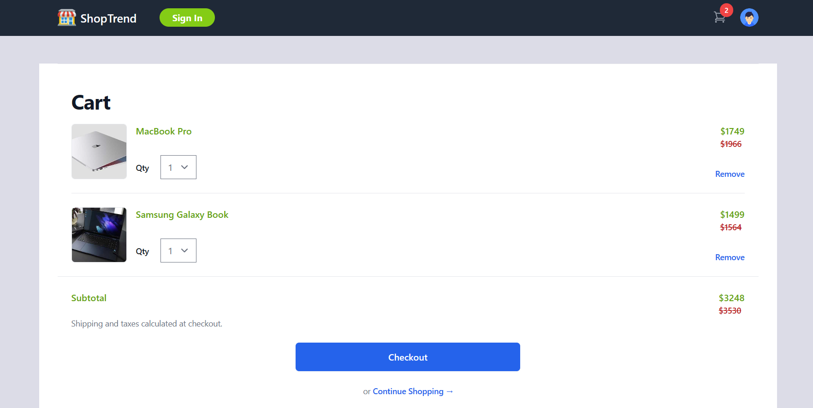
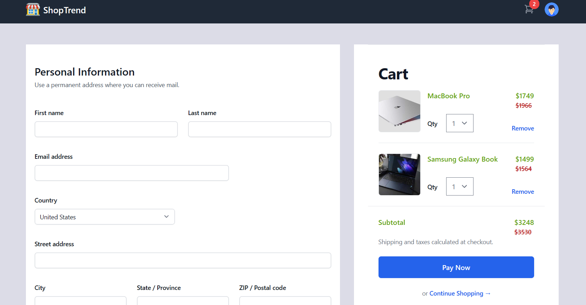

# 🛍️ ShopTrend Ecommerce App (https://akash-prasad-shoptrend.netlify.app/)

#Demo Credentials
email:john@email.com
pass:12345678

Welcome to ShopTrend! 🎉 This is a cutting-edge e-commerce app built with Vite, React.js, GraphQL, Redux, and Apollo Client. The app leverages the power of the Graphbase serverless GraphQL API for seamless product management.

## Images






### Installation 🚀

1. **Grafbase local Setup:**

   ```bash
   npx grafbase dev

   ```

   Navigate to [http://127.0.0.1:4000/](http://127.0.0.1:4000/) to grafbase Pathfinder.


2. **Clone the repository:**

   ```bash
   git clone https://github.com/AKASH-PRASAD7/Disney-clone.git
   cd client
   ```

3. **Install Dependencies:** Choose your favorite package manager!

   Using Yarn:

   ```bash
   yarn install
   ```

   Or npm:

   ```bash
   npm install
   ```

## GraphQL Queries 🔍

Here are some example GraphQL queries you can use:

### Get All Products

```graphql
query ProductDetailsCollection {
  productDetailsCollection(first: 15) {
    pageInfo {
      hasNextPage
    }
    edges {
      node {
        title
        description
        price
        discountPercentage
        rating
        brand
        thumbnail
        category
        id
        images
      }
    }
  }
}
```

### Get Product by ID

```graphql
query ProductDetails($id: ID) {
  productDetails(by: { id: $id }) {
    title
    description
    price
    discountPercentage
    rating
    brand
    thumbnail
    category
    id
    images
  }
}
```

### Search Products

```graphql
query ProductDetailsSearch($input: String) {
  productDetailsSearch(query: $input, first: 30) {
    pageInfo {
      hasNextPage
    }
    edges {
      node {
        title
        description
        price
        discountPercentage
        rating
        brand
        thumbnail
        category
        id
        images
      }
    }
  }
}
```

### Create User

```graphql
mutation UserCreate {
  userCreate(
    input: { name: "John Doe", email: "john@email.com", password: "1234568" }
  ) {
    user {
      name
    }
  }
}
```

### Configuration ⚙️

Rename `.env.example` to `.env` and update it with your API endpoints or authentication keys.

### Usage 🚀

Kickstart the development server:

```bash
yarn dev
```

Or with npm:

```bash
npm run dev
```

Navigate to [http://localhost:5173](http://localhost:5173) to see your app in action.

### Build 🏗️

When you're ready to deploy to production:

```bash
yarn build
```

Or using npm:

```bash
npm run build
```

### Deployment 🚀

Deploy your finely crafted app to your chosen hosting platform. Don't forget to configure environment variables and server settings!

## Features 🌟

- 📦 Browse products with dynamic category filters
- 🛒 Cart functionality: Adjust quantities and breeze through checkout
- 👤 User authentication and profile management
- 📊 State management via Redux
- 🔄 Data fetching using Apollo Client and GraphQL
- 💎 Graphbase integration for efficient product data handling
- 🔍 Filter products by categories
- 🔀 Sort products by price and rating
- 📱 Responsive design catering to mobile and desktop users

## Technologies Used 👨‍💻

- ⚡ Vite: Rapid and efficient build tooling
- ⚛️ React.js: Crafting beautiful UI components
- 🔗 GraphQL: Unleash the power of query language for APIs
- 🔄 Redux: Taming complex app states
- 🚀 Apollo Client: Fetching data with style
- 🌐 Graphbase: Lightning-fast serverless GraphQL API
- 🧶 Yarn or npm: The magic wands of dependency management

## License 📜

This project is licensed under the [MIT License](LICENSE).

---
